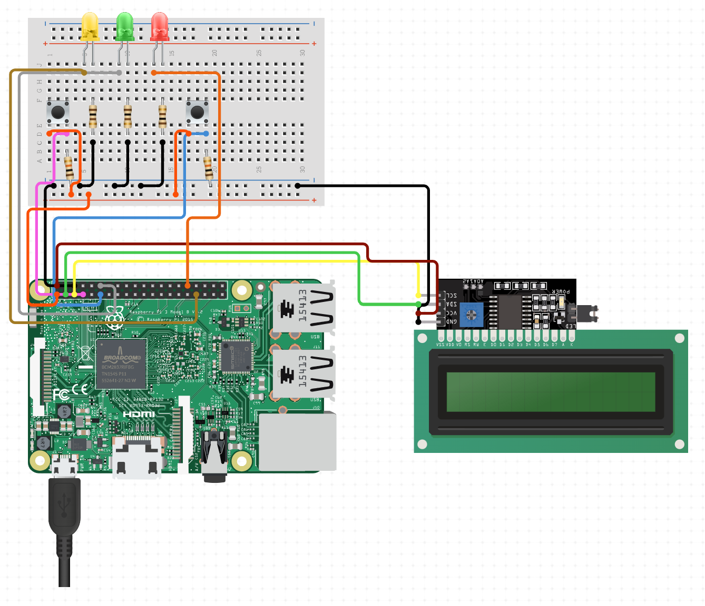

# Raspberry Pi Server 

A script to add a power button, LEDs, and an LCD to a Raspberry Pi server.

Written in Python using RPI.GPIO for GPIO pin control.

## About

The power button allows the server to enter sleep mode or shut down, with its current state indicated by the LEDs.

The LCD provides real-time system information, including uptime, CPU temperature and usage, memory usage, network activity, and disk usage, refreshing every 30 seconds.

## Setup

### Physical Components
The following GPIO components are required to run this project:
- Raspberry Pi running Ubuntu Server
- 1x IC2 LCD16x2
- 2x Momentary push button
- 1x Red LED
- 1x Yellow LED
- 1x Green LED
- 3x 100Ω resistor
- 2x 1000Ω resistor
- Jumper wires

Connect the components following the diagram below:

<p align="center"></p>

### Install Dependencies

1. **Install smbus2, psutil, and pytz:**
    ```bash
    sudo pip3 install smbus2 psutil pytz
    ```

2. **Install RPI GPIO:**
    ```bash
    sudo apt install python3-rpi.gpio
    ```

### Download Script

1. **Clone the repository:**
    ```bash
    git clone https://github.com/siddhp1/Raspberry-Pi-Server.git
    cd Raspberry-Pi-Server
    ```

2. **Configure script:**

    To configure the GPIO pins and display screens, edit the config.json file located in the extracted directory.

    To configure the sleep settings, edit the server.py file located in the extracted directory.

### Setup Service

1. **Create a service file:**

    ```bash
    sudo nano /etc/systemd/system/server.service
    ```

2. **Configure the service file:**

    ```bash
    [Unit]
    Description=Server
    After=multi-user.target

    [Service]
    # Edit this path to the script
    ExecStart=/usr/bin/python3 /path/to/your/script/server.py
    # Edit this path to the script working directory
    WorkingDirectory=/path/to/your/script/
    StandardOutput=inherit
    StandardError=inherit
    Restart=always
    # Change this user to the root user
    User=pi

    [Install]
    WantedBy=multi-user.target
    ```

3. **Enable the service:**

    ```bash
    sudo systemctl enable server.service
    ```

4. **Start the service:**

    ```bash
    sudo systemctl start server.service
    ```

5. **Check the service status:**

    ```bash
    sudo systemctl status server.service
    ```

6. **Reboot your Raspberry Pi:**

    ```bash
    sudo reboot
    ```
    The script should automatically start when your Raspberry Pi turns on. 

## Usage

Once the service is configured, the script will automatically execute on startup. 

The green LED indicates the server is in its normal state, while the yellow LED signals sleep mode. The red LED flashes briefly before shutdown. 

Press the power button to toggle the server between sleep and active states. Hold the power button for more than 3 seconds to initiate a shutdown. 

The LCD display provides live system statistics, refreshing every 30 seconds. Use the cycle button to switch between different screens as defined in the configuration file.

# License

This project is licensed under the MIT License.
